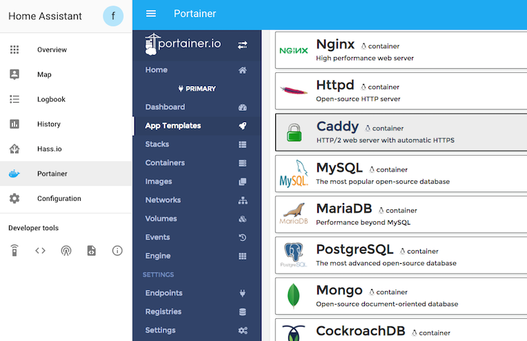
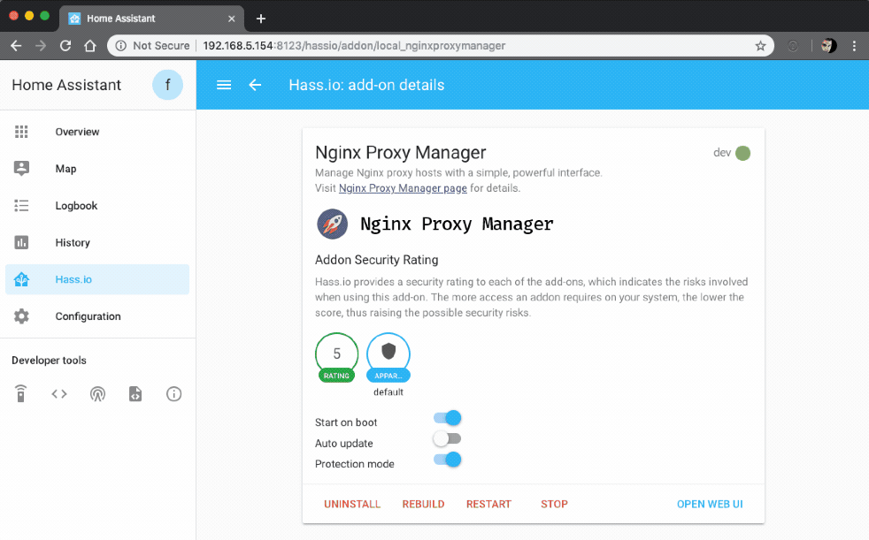

# Backup repository for discontinued or customized Home Assistant Stuff

nothing special here. everything is quick and dirty copy/paste

> Quick Note: "A+number" is an internal counter, primarily to get
> kind of a "directory structure" in this repo.

Add-on documentation: (not necessary)

## Add-ons

For the beginning i copied following add-ons:

### [A01 | Portainer Add-on](./portainer)

[![GitHub Release][a01-releases-shield]][a01-releases]
![Project Stage][a01-project-stage-shield]
[![License][a01-license-shield]](./LICENSES/A01.md)

![Supports aarch64 Architecture][a01-aarch64-shield]
![Supports amd64 Architecture][a01-amd64-shield]
![Supports armhf Architecture][a01-armhf-shield]
![Supports armv7 Architecture][a01-armv7-shield]
![Supports i386 Architecture][a01-i386-shield]

[![Github Actions][a01-github-actions-shield]][a01-github-actions]
![Project Maintenance][a01-maintenance-shield]
[![GitHub Activity][a01-commits-shield]][a01-commits]

[![Discord][a01-discord-shield]][a01-discord]
[![Community Forum][a01-forum-shield]][a01-forum]

[![Sponsor Frenck via GitHub Sponsors][a01-github-sponsors-shield]][a01-github-sponsors]

[![Support Frenck on Patreon][a01-patreon-shield]][a01-patreon]

> Manage your Docker environment with ease.

---

### [A02 | CUSTOM nginx-proxy-manager Add-on](./custom-npm)

[![GitHub Release][a02-releases-shield]][a02-releases]
![Project Stage][a02-project-stage-shield]
[![License][a02-license-shield]](./LICENSES/A02.md)

![Supports aarch64 Architecture][a02-aarch64-shield]
![Supports amd64 Architecture][a02-amd64-shield]
![Supports armhf Architecture][a02-armhf-shield]
![Supports armv7 Architecture][a02-armv7-shield]
![Supports i386 Architecture][a02-i386-shield]

[![Github Actions][a02-github-actions-shield]][a02-github-actions]
![Project Maintenance][a02-maintenance-shield]
[![GitHub Activity][a02-commits-shield]][a02-commits]

[![Discord][a02-discord-shield]][a02-discord]
[![Community Forum][a02-forum-shield]][a02-forum]

[![Sponsor Frenck via GitHub Sponsors][a02-github-sponsors-shield]][a02-github-sponsors]

[![Support Frenck on Patreon][a02-patreon-shield]][a02-patreon]

Manage Nginx proxy hosts with a simple, powerful interface.

[Source on Github](https://github.com/hassio-addons/addon-nginx-proxy-manager)

---

### [A03 | Add-on 3](https://elias1731.de/info)

> coming soon (ig)

<!--#A01-->

[a01-aarch64-shield]: https://img.shields.io/badge/aarch64-yes-green.svg
[a01-amd64-shield]: https://img.shields.io/badge/amd64-yes-green.svg
[a01-armhf-shield]: https://img.shields.io/badge/armhf-yes-green.svg
[a01-armv7-shield]: https://img.shields.io/badge/armv7-yes-green.svg
[a01-commits-shield]: https://img.shields.io/github/commit-activity/y/hassio-addons/addon-portainer.svg
[a01-commits]: https://github.com/hassio-addons/addon-portainer/commits/main
[a01-contributors]: https://github.com/hassio-addons/addon-portainer/graphs/contributors
[a01-discord-ha]: https://discord.gg/c5DvZ4e
[a01-discord-shield]: https://img.shields.io/discord/478094546522079232.svg
[a01-discord]: https://discord.me/hassioaddons
[a01-docs]: https://github.com/hassio-addons/addon-portainer/blob/main/portainer/DOCS.md
[a01-forum-shield]: https://img.shields.io/badge/community-forum-brightgreen.svg
[a01-forum]: https://community.home-assistant.io/t/home-assistant-community-add-on-portainer/68836?u=frenck
[a01-frenck]: https://github.com/frenck
[a01-github-actions-shield]: https://github.com/hassio-addons/addon-portainer/workflows/CI/badge.svg
[a01-github-actions]: https://github.com/hassio-addons/addon-portainer/actions
[a01-github-sponsors-shield]: https://frenck.dev/wp-content/uploads/2019/12/github_sponsor.png
[a01-github-sponsors]: https://github.com/sponsors/frenck
[a01-i386-shield]: https://img.shields.io/badge/i386-no-red.svg
[a01-issue]: https://github.com/hassio-addons/addon-portainer/issues
[a01-license-shield]: https://img.shields.io/github/license/hassio-addons/addon-portainer.svg
[a01-maintenance-shield]: https://img.shields.io/maintenance/yes/2021.svg
[a01-patreon-shield]: https://frenck.dev/wp-content/uploads/2019/12/patreon.png
[a01-patreon]: https://www.patreon.com/frenck
[a01-project-stage-shield]: https://img.shields.io/badge/project%20stage-%20!%20DEPRECATED%20%20%20!-ff0000.svg
[a01-reddit]: https://reddit.com/r/homeassistant
[a01-releases-shield]: https://img.shields.io/github/release/hassio-addons/addon-portainer.svg
[a01-releases]: https://github.com/hassio-addons/addon-portainer/releases
[a01-repository]: https://github.com/hassio-addons/repository

<!--#A02-->

[a02-aarch64-shield]: https://img.shields.io/badge/aarch64-yes-green.svg
[a02-amd64-shield]: https://img.shields.io/badge/amd64-yes-green.svg
[a02-armhf-shield]: https://img.shields.io/badge/armhf-yes-green.svg
[a02-armv7-shield]: https://img.shields.io/badge/armv7-yes-green.svg
[a02-commits-shield]: https://img.shields.io/github/commit-activity/y/hassio-addons/addon-nginx-proxy-manager.svg
[a02-commits]: https://github.com/hassio-addons/addon-nginx-proxy-manager/commits/main
[a02-contributors]: https://github.com/hassio-addons/addon-nginx-proxy-manager/graphs/contributors
[a02-discord-ha]: https://discord.gg/c5DvZ4e
[a02-discord-shield]: https://img.shields.io/discord/478094546522079232.svg
[a02-discord]: https://discord.me/hassioaddons
[a02-docs]: https://github.com/hassio-addons/addon-nginx-proxy-manager/blob/main/proxy-manager/DOCS.md
[a02-forum-shield]: https://img.shields.io/badge/community-forum-brightgreen.svg
[a02-forum]: https://community.home-assistant.io/t/home-assistant-community-add-on-nginx-proxy-manager/111830?u=frenck
[a02-frenck]: https://github.com/frenck
[a02-github-actions-shield]: https://github.com/hassio-addons/addon-nginx-proxy-manager/workflows/CI/badge.svg
[a02-github-actions]: https://github.com/hassio-addons/addon-nginx-proxy-manager/actions
[a02-github-sponsors-shield]: https://frenck.dev/wp-content/uploads/2019/12/github_sponsor.png
[a02-github-sponsors]: https://github.com/sponsors/frenck
[a02-i386-shield]: https://img.shields.io/badge/i386-yes-green.svg
[a02-issue]: https://github.com/hassio-addons/addon-nginx-proxy-manager/issues
[a02-license-shield]: https://img.shields.io/github/license/hassio-addons/addon-nginx-proxy-manager.svg
[a02-maintenance-shield]: https://img.shields.io/maintenance/yes/2022.svg
[a02-patreon-shield]: https://frenck.dev/wp-content/uploads/2019/12/patreon.png
[a02-patreon]: https://www.patreon.com/frenck
[a02-project-stage-shield]: https://img.shields.io/badge/project%20stage-experimental-yellow.svg
[a02-reddit]: https://reddit.com/r/homeassistant
[a02-releases-shield]: https://img.shields.io/github/release/hassio-addons/addon-nginx-proxy-manager.svg
[a02-releases]: https://github.com/hassio-addons/addon-nginx-proxy-manager/releases
[a02-repository]: https://github.com/hassio-addons/repository
